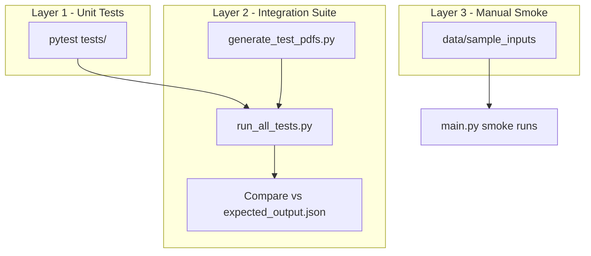

# Project Testing Plan

How to verify the Eightfold candidate pipeline end-to-end: parsing, normalization, validation, matching, conflict resolution, confidence/quality scoring, projection, and error handling.

For the full synthetic suite layout and module matrix, see [test_cases/README.md](test_cases/README.md). Each individual test case folder also has its own `README.md` explaining what is tested and why the expected output is correct.

---

## Testing Architecture (3 Layers)



| Layer | What it proves | Where |
|-------|----------------|-------|
| **1. Unit** | Individual modules in isolation | [tests/](tests/) (90 tests) |
| **2. Black-box** | Full pipeline on 59 synthetic scenarios | [test_cases/](test_cases/) |
| **3. Smoke** | Real-world sample files still work | [data/sample_inputs/](data/sample_inputs/) |

**Recommended order:** Layer 1 first (fast), then Layer 2, then Layer 3 smoke runs after any significant change.

---

## Prerequisites (one-time setup)

```bash
cd /path/to/Eightfold
python3 -m venv .venv
source .venv/bin/activate
pip install -r requirements.txt
pip install fpdf2   # only needed to generate test PDFs from resume.txt
```

If `python` is not found, use `python3` or `.venv/bin/python` in all commands below.

---

## Layer 1 — Unit Tests (run first)

Fastest signal that core logic is intact. Run before any integration or smoke tests.

```bash
pytest                          # full suite
pytest tests/test_normalize.py  # phones, dates, skills, location
pytest tests/test_matcher.py    # email / phone / fuzzy name matching
pytest tests/test_decision_engine.py
pytest tests/test_projection.py
pytest tests/test_resume_adapter.py
pytest tests/test_edge_cases.py
pytest --cov=src tests/         # optional coverage report
```

### Module coverage map

| Test file | Pipeline phase |
|-----------|----------------|
| [tests/test_normalize.py](tests/test_normalize.py) | Normalize (E.164, dates, skills, country) |
| [tests/test_matcher.py](tests/test_matcher.py) | Match (email, phone, fuzzy name) |
| [tests/test_decision_engine.py](tests/test_decision_engine.py) | Validate → Resolve → Confidence → Review |
| [tests/test_projection.py](tests/test_projection.py) | Project (field select, remap, on_missing) |
| [tests/test_resume_adapter.py](tests/test_resume_adapter.py) | Parse (resume sections, fields, DOCX) |
| [tests/test_edge_cases.py](tests/test_edge_cases.py) | Edge / fallback behavior |

**Pass criteria:** all tests green, zero failures.

---

## Layer 2 — Black-Box Integration Suite (59 cases)

The suite lives under [test_cases/](test_cases/) in nine categories:

| Category | Folder | # TCs | Focus |
|----------|--------|-------|-------|
| Happy path | [01_happy_path/](test_cases/01_happy_path/) | 5 | Clean merge, no conflicts |
| Candidate matching | [02_candidate_matching/](test_cases/02_candidate_matching/) | 6 | Email / phone / fuzzy name |
| Conflict resolution | [03_conflict_resolution/](test_cases/03_conflict_resolution/) | 8 | Severity, source priority |
| Validation | [04_validation/](test_cases/04_validation/) | 8 | Bad inputs rejected |
| Normalization | [05_normalization/](test_cases/05_normalization/) | 6 | E.164, ISO country, dates |
| Projection | [06_projection/](test_cases/06_projection/) | 5 | Configurable output shape |
| Error handling | [07_error_handling/](test_cases/07_error_handling/) | 6 | Empty / garbage inputs |
| Edge cases | [08_edge_cases/](test_cases/08_edge_cases/) | 10 | Unicode, layout stress |
| Extended coverage | [09_extended_coverage/](test_cases/09_extended_coverage/) | 5 | DOCX, resume-dir, engine-config |

Each case folder (`TCxx/`) typically contains:

- `resume.txt` — human-readable resume body (source for PDF/DOCX generation)
- `resume.pdf` — generated PDF for the pipeline (see Step A)
- `recruiter.csv` — recruiter CSV input
- `expected_output.json` — deterministic expected pipeline output
- `projection.json` — custom projection config (only when needed)
- `engine_config.json` — custom engine config (only when needed)
- `README.md` — purpose, modules validated, why the expected result is correct

### Step A — Generate PDFs / DOCX from resume.txt

The pipeline expects PDF or DOCX resumes. Generate all test artifacts in one step:

```bash
python test_cases/generate_test_pdfs.py
```

This scans every `test_cases/**/resume.txt` (and `resumes/*.txt`) and writes matching `.pdf` / `.docx` files. Re-run after editing any `resume.txt`.

**Tip:** To read resume content, open `resume.txt` — do not try to read the binary PDF directly.

### Step B — Run full suite (recommended)

```bash
python test_cases/run_all_tests.py
```

Writes `test_results.json` and `TEST_RESULTS.md` at the repo root. Runs unit tests first, then all 59 integration cases.

### Step C — Run a single test case

Standard command (uses default [config/projection_config.json](config/projection_config.json)):

```bash
python main.py \
  --resume         test_cases/<category>/TCxx/resume.pdf \
  --recruiter-csv  test_cases/<category>/TCxx/recruiter.csv \
  --output         output/TCxx_result.json
```

When a case folder contains `projection.json`, pass it explicitly:

```bash
python main.py \
  --resume         test_cases/06_projection/TC01/resume.pdf \
  --recruiter-csv  test_cases/06_projection/TC01/recruiter.csv \
  --projection     test_cases/06_projection/TC01/projection.json \
  --output         output/projection_tc01_result.json
```

**Example — happy path merge** ([test_cases/01_happy_path/TC02/](test_cases/01_happy_path/TC02/)):

```bash
python main.py \
  --resume test_cases/01_happy_path/TC02/resume.pdf \
  --recruiter-csv test_cases/01_happy_path/TC02/recruiter.csv \
  --output output/tc02_result.json
```

Compare your output against [test_cases/01_happy_path/TC02/expected_output.json](test_cases/01_happy_path/TC02/expected_output.json). Read [test_cases/01_happy_path/TC02/README.md](test_cases/01_happy_path/TC02/README.md) for the rationale.

You may pass only `--resume` or only `--recruiter-csv` when a case is designed for a single source (see that case's README).

### Step D — Recommended execution order

Run categories in this order so failures are easier to localize:

1. **01_happy_path** — baseline merge works
2. **05_normalization** — E.164, ISO country, dates, skills
3. **02_candidate_matching** — email / phone / fuzzy name merge
4. **04_validation** — bad email / phone rejected
5. **03_conflict_resolution** — source priority, severity, provenance
6. **06_projection** — configurable output (always use `--projection`)
7. **07_error_handling** — empty / garbage inputs, no crash
8. **08_edge_cases** — unicode, multi-column, unusual delimiters
9. **09_extended_coverage** — DOCX, resume-dir batch, custom engine config

Within each category, run `TC01`, then `TC02`, and so on.

### Step E — Pass / fail criteria

- **Structure:** output has `summary` and `candidates` keys matching `expected_output.json`
- **Fields:** check `full_name`, `primary_email`, `phone`, `skills`, `status`, `overall_confidence`, and category-specific fields (e.g. `conflict_log` for conflict cases)
- **Tolerances:** skill list order may differ; confidence floats may differ by ±0.05
- **No crash:** pipeline completes with exit code 0 even for error-handling cases

---

## Layer 3 — Manual Smoke Tests

Verify real sample data after significant changes:

```bash
# Resume only
python main.py \
  --resume "data/sample_inputs/resumes/Nandini_NIT_Delhi (3).pdf" \
  --output output/result.json

# CSV only
python main.py \
  --recruiter-csv data/sample_inputs/candidates.csv \
  --output output/csv_only.json

# Both sources together
python main.py \
  --resume "data/sample_inputs/resumes/Nandini_NIT_Delhi (3).pdf" \
  --recruiter-csv data/sample_inputs/candidates.csv \
  --output output/combined.json
```

**Smoke checks:**

- Process exits without error
- Emails are lowercase and well-formed
- Phones are E.164 when present
- Projects are separate from experience (no false job entries)
- Location is inferred from education when not explicit on resume
- `links` includes LinkedIn / LeetCode when present in resume text

---

## Pipeline Phase Checklist

Use this to confirm each stage of the pipeline when investigating a failure:

| Phase | What it does | Verify via |
|-------|--------------|------------|
| **Parse** | CSV + resume → raw SourceRecords | Integration TCs; [tests/test_resume_adapter.py](tests/test_resume_adapter.py) |
| **Normalize** | E.164, lowercase email, canonical skills, dates | [tests/test_normalize.py](tests/test_normalize.py); [05_normalization/](test_cases/05_normalization/) |
| **Validate** | Reject bad email, phone, dates | [04_validation/](test_cases/04_validation/) |
| **Match** | Group records by same candidate | [tests/test_matcher.py](tests/test_matcher.py); [02_candidate_matching/](test_cases/02_candidate_matching/) |
| **Resolve** | Pick winners, merge lists, log conflicts | [03_conflict_resolution/](test_cases/03_conflict_resolution/) |
| **Confidence / Review** | Score fields, flag manual_review | Expected `status`, `overall_confidence`, `review_reasons` |
| **Project** | Shape output per config | [tests/test_projection.py](tests/test_projection.py); [06_projection/](test_cases/06_projection/) |
| **Error handling** | Graceful degradation, no crash | [07_error_handling/](test_cases/07_error_handling/) |

Configuration files (change behavior without code edits):

- [config/engine_config.json](config/engine_config.json) — source priorities, confidence weights, review thresholds
- [config/projection_config.json](config/projection_config.json) — default output field selection and normalization

---

## Troubleshooting

| Problem | Fix |
|---------|-----|
| `python: command not found` | Use `python3` or `source .venv/bin/activate` |
| `resume.pdf` missing | Run `python test_cases/generate_test_pdfs.py` |
| Output differs from expected | Read that TC's `README.md`; check for `projection.json` |
| Wrong fields in output | Confirm you passed `--projection` for category 06 cases |
| Resume fields parsed wrong | Inspect `resume.txt`; PDF line-wrapping can affect extraction |
| Two profiles instead of one | Email / phone may not match between CSV and resume — check both inputs |
| `primary_email` is null | Validation rejected the email — see category 04 cases |

---

## Quick Reference

```bash
# Step 1 — Regenerate test PDFs/DOCX from resume.txt
python test_cases/generate_test_pdfs.py

# Step 2 — Run everything (unit + integration); writes test_results.json + TEST_RESULTS.md
python test_cases/run_all_tests.py

# Unit tests only
pytest

# Run one integration case
python main.py \
  --resume test_cases/01_happy_path/TC02/resume.pdf \
  --recruiter-csv test_cases/01_happy_path/TC02/recruiter.csv \
  --output output/tc02_result.json

# Smoke test (real resume)
python main.py \
  --resume "data/sample_inputs/resumes/Nandini_NIT_Delhi (3).pdf" \
  --output output/result.json
```

Further detail on the 59-case suite, determinism guarantees, and per-module coverage: [test_cases/README.md](test_cases/README.md).
